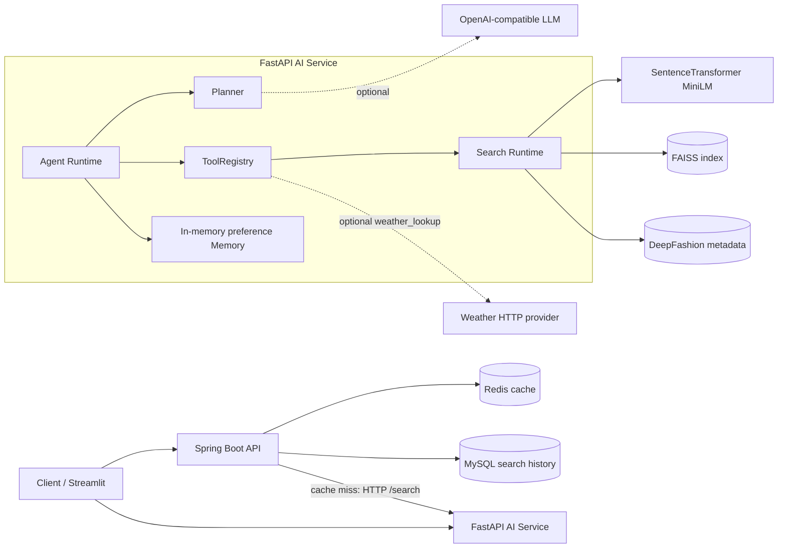
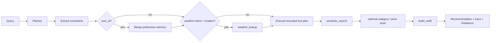

# Fashion Semantic Search

[](https://github.com/by-FeiHong/fashion-semantic-search/actions/workflows/ci.yml)

**A production-shaped semantic fashion retrieval API with an explainable, tool-calling outfit recommendation agent.**

Search DeepFashion products in natural language, serve results through a layered Spring Boot API, and turn a request such as “What should I wear in Lund tomorrow?” into a bounded recommendation workflow with optional weather and user preferences.

- **Semantic retrieval:** SentenceTransformer embeddings and FAISS cosine-similarity search.
- **Backend engineering:** Spring Boot API, Redis cache-aside, MySQL search history, structured errors, statistics, and OpenAPI.
- **Agent workflow:** provider-neutral planner, typed tool registry, weather-aware constraints, preference memory, deterministic fallback, and traceable results.
- **Deployable stack:** Docker Compose starts Spring Boot, FastAPI, Redis, and MySQL with health checks.

> This is an engineering portfolio project built on the DeepFashion In-shop Clothes Retrieval Benchmark. DeepFashion supplies product/image metadata, not dependable prices, live weather, or rich garment suitability attributes. Those limits are surfaced rather than hidden.

## Demo Screenshots

Screenshots are intentionally not fabricated. The repository does not yet contain suitable demo captures; add verified Streamlit search and Agent API examples to `assets/` before the final public release.

## Features

- Natural-language fashion search through Java or FastAPI APIs.
- A persistent Python runtime that loads the MiniLM model, FAISS index, and aligned metadata once at startup.
- Ports-and-adapters Spring Boot service with consistent response envelopes and validated inputs.
- Redis cache-aside with hashed keys, configurable TTL, and graceful fallback when Redis is unavailable.
- MySQL search-history persistence and aggregate statistics; history-write failures do not fail searches.
- Typed tools for semantic search, category filtering, price filtering, weather lookup, and outfit construction.
- Single-agent planning with bounded execution, duplicate-call protection, tool trace, and deterministic fallback when the LLM is disabled or fails.
- Constraint-aware recommendations with explicit supported/unsupported fields and no invented attribute scores.
- Optional weather context and explicit per-user preference memory.
- Swagger UI for Spring Boot and generated FastAPI documentation.
- Streamlit search UI plus offline dataset, indexing, CLIP experiment, and evaluation scripts.

## System Architecture



The public Java path is `controller → service → SearchEnginePort → HTTP adapter → FastAPI`. Redis and MySQL belong to Spring Boot: Redis accelerates repeated search requests, while MySQL records successful-search metrics. Agent, tool, weather, and preference endpoints belong to FastAPI only.

### Agent Workflow



The planner may use an OpenAI-compatible provider, but `disabled` is the safe default. An invalid or unavailable plan degrades to deterministic semantic search followed by outfit construction. The response exposes a compact plan summary and tool status/timing—not hidden chain-of-thought.

## Technology Stack

| Area | Technologies |
| --- | --- |
| Backend | Java 17, Spring Boot 3.3, Spring Web, Validation, Spring Data JPA, springdoc-openapi, FastAPI, Pydantic |
| AI | sentence-transformers `all-MiniLM-L6-v2`, FAISS, optional OpenAI-compatible planner, experimental CLIP tooling |
| Data | DeepFashion In-shop benchmark, MySQL 8.4 search history, in-memory user-preference store |
| Infra | Docker Compose, Redis 7, Maven, pytest, GitHub Actions, Streamlit |

## Capability Status

| Capability | Standard mode | `demo_mode=true` | Notes |
| --- | --- | --- | --- |
| Semantic text search | Available | Same | Uses real indexed DeepFashion metadata. |
| Category filtering / outfit assembly | Available | Same | Deterministic; reports missing categories and substitutions. |
| Color/style/season/occasion constraints | Best effort | Same | Used only where candidate metadata contains supporting text; unsupported fields are reported. |
| Price filtering / budget | Only with real price fields | Available with synthetic prices | DeepFashion does not provide reliable retail prices. Synthetic values are deterministic and marked `price_source=synthetic_demo`. |
| Weather-aware constraints | Available when a weather provider is configured | Same | Weather is external data. Derived clothing suggestions are reported separately and do not invent waterproof/warmth attributes. |
| User preference memory | Available per process | Same | Current adapter is in-memory; preferences do not survive restart and are not stored in MySQL. |
| LLM planning | Available when configured | Same | Default is disabled; deterministic fallback remains available. |
| CLIP image/hybrid retrieval | Experimental scripts | Same | Not the default Streamlit or production API path. |

## Quick Start

### Prerequisites

- Docker Desktop with Compose
- Prepared `data/processed/fashion.index`, `metadata_index.csv`, and `metadata.csv`
- A local Hugging Face cache containing `sentence-transformers/all-MiniLM-L6-v2`, or permission to download it

The DeepFashion dataset and generated model/index artifacts are deliberately not committed. See [Dataset and Index Preparation](#dataset-and-index-preparation) if they are not ready.

```powershell
Copy-Item .env.example .env
# Edit passwords and FASHION_SEARCH_MODEL_CACHE_HOST_PATH in .env
docker compose config
docker compose up --build -d
docker compose ps
Invoke-RestMethod http://localhost:8080/api/health
```

Once healthy, run a search:

```powershell
Invoke-RestMethod http://localhost:8080/api/search -Method Post `
  -ContentType "application/json" `
  -Body '{"query":"minimal black dress","topK":5}'
```

## Docker Compose

Compose starts `mysql`, `redis`, `fastapi`, and `spring-boot` on a private network. MySQL and Redis are not published to the host; the HTTP services use ports `8080` and `8000` by default. Large data and model files are read-only host mounts.

```powershell
# Follow logs
docker compose logs -f

# Stop containers and preserve MySQL data
docker compose down

# Rebuild after code changes
docker compose up --build --force-recreate -d
```

Set `SPRING_BOOT_PORT_HOST=18080` or `FASTAPI_PORT_HOST=18000` in `.env` if a default port is occupied. On Windows, use a forward-slash absolute model-cache path, for example `C:/Users/alice/.cache/huggingface`.

`docker compose down --volumes` also deletes the MySQL named volume and its data. Never commit `.env`; `.env.example` is the version-controlled template.

## Local Development

Local development needs Python 3.11+, Java 17, Maven, plus reachable Redis and MySQL instances. From the project root:

```powershell
.\.venv\Scripts\Activate.ps1
python -m pip install -r requirements.txt
python -m uvicorn ai_service.app:app --host 127.0.0.1 --port 8000
```

Start Spring Boot in another terminal after configuring MySQL. Redis is optional at runtime because cache failures fall back to FastAPI.

```powershell
$env:MYSQL_HOST = "localhost"
$env:MYSQL_PORT = "3306"
$env:MYSQL_DATABASE = "fashion_search"
$env:MYSQL_USERNAME = "fashion_search"
$env:MYSQL_PASSWORD = "fashion_search"
cd java-backend
mvn spring-boot:run
```

Run the Streamlit search UI separately:

```powershell
$env:DEEPFASHION_ROOT = "D:\Datasets\DeepFashion\In-shop"
streamlit run app.py
```

FastAPI must run from the repository root so its default artifact paths resolve correctly. Deployment-specific search paths, timeouts, cache TTL, model settings, LLM provider, and weather provider are configurable through environment variables; see `.env.example`, `ai_service/llm.py`, `ai_service/weather.py`, and `java-backend/src/main/resources/application.yml`.

## API Docs

| Service | Interactive docs | OpenAPI document |
| --- | --- | --- |
| Spring Boot | [http://localhost:8080/swagger-ui/index.html](http://localhost:8080/swagger-ui/index.html) | [http://localhost:8080/v3/api-docs](http://localhost:8080/v3/api-docs) |
| FastAPI | [http://localhost:8000/docs](http://localhost:8000/docs) | [http://localhost:8000/openapi.json](http://localhost:8000/openapi.json) |

Spring Boot documents `GET /api/health`, `POST /api/search`, and `GET /api/stats`. FastAPI owns `/health`, `/search`, `/tools`, `/tools/{name}/invoke`, `/agent/recommend`, and `/memory/preferences/{user_id}`.

## Example Requests

### 1. Semantic search

Use the public Spring Boot API for a normal application request:

```powershell
Invoke-RestMethod http://localhost:8080/api/search -Method Post `
  -ContentType "application/json" `
  -Body '{"query":"blue denim jacket for a casual weekend","topK":5}'
```

The Java response uses the shared `{success, data, message, timestamp}` envelope. A cache hit skips FastAPI; every successful request is recorded in search history with duration and cache-hit status.

### 2. Weather-aware Agent recommendation

Configure a compatible weather endpoint first; it receives `location`, `date`, and optionally `api_key`, and must return JSON containing at least a recognizable temperature field.

```powershell
$env:FASHION_WEATHER_PROVIDER = "http"
$env:FASHION_WEATHER_BASE_URL = "https://your-weather-adapter.example/forecast"
$env:FASHION_WEATHER_API_KEY = "replace-with-secret"
$env:FASHION_WEATHER_TIMEOUT_SECONDS = "5"

Invoke-RestMethod http://localhost:8000/agent/recommend -Method Post `
  -ContentType "application/json" `
  -Body '{"query":"What should I wear in Lund tomorrow? I prefer black minimalist clothes.","max_steps":6}'
```

The Agent extracts Lund and tomorrow, attempts `weather_lookup`, retrieves candidates, and calls `build_outfit`. If weather fails or is disabled, the response is marked degraded and continues without weather instead of fabricating a forecast.

To apply stored preferences explicitly:

```powershell
Invoke-RestMethod http://localhost:8000/memory/preferences/user-123 -Method Put `
  -ContentType "application/json" `
  -Body '{"preferred_colors":["black"],"preferred_styles":["minimalist"]}'

Invoke-RestMethod http://localhost:8000/agent/recommend -Method Post `
  -ContentType "application/json" `
  -Body '{"query":"What should I wear in Lund tomorrow?","user_id":"user-123"}'
```

Query constraints override conflicting stored preferences. Do not enable `demo_mode` for genuine price-sensitive recommendations unless synthetic, clearly labeled demonstration prices are acceptable.

## Dataset and Index Preparation

Place the DeepFashion In-shop Clothes Retrieval Benchmark outside the repository, then prepare metadata and build the text index:

```powershell
python scripts/check_dataset.py
python scripts/load_metadata.py
python scripts/export_metadata.py
python scripts/build_embeddings.py --limit 0 --batch-size 64 `
  --output data/processed/embeddings_full.npy `
  --metadata-output data/processed/metadata_index_full.csv
python scripts/build_index.py `
  --embeddings data/processed/embeddings_full.npy `
  --metadata data/processed/metadata_index_full.csv `
  --output data/processed/fashion_full.index
```

The active service expects filenames `fashion.index` and `metadata_index.csv`; either copy the validated full artifacts to those names or override the corresponding `FASHION_SEARCH_*_PATH` variables. `scripts/search.py` remains available for offline debugging.

CLIP builders and fusion evaluation remain experimental. Run `python scripts/evaluate_search.py` before adopting a candidate index; the stable application path uses MiniLM text embeddings.

## Testing

Python tests use injected runtimes/providers and do not require live external services. Java tests use H2 and MockWebServer, so they do not require MySQL, Redis, or FastAPI.

```powershell
python -m pytest
python -m compileall -q ai_service app.py scripts tests
cd java-backend
mvn test
cd ..
git diff --check
```

CI runs the Python suite and compile check, Java suite, and Docker Compose configuration validation on pushes to `main` and pull requests.

## Architecture Decisions

- **Persistent AI runtime:** model, FAISS index, and metadata load once in FastAPI rather than once per Java request.
- **Ports and adapters:** Spring business logic depends on `SearchEnginePort`, `CachePort`, and `SearchHistoryPort`; HTTP, Redis, and JPA stay behind adapters.
- **Resilient secondary infrastructure:** Redis and history persistence improve the service but do not determine whether a valid search succeeds.
- **Small typed tool layer:** a local `ToolRegistry` provides schemas, validation, invocation, and consistent errors without adopting a heavyweight agent framework.
- **Bounded, inspectable Agent:** maximum steps, duplicate suppression, deterministic fallback, and a public execution trace make failure behavior explicit.
- **Provider-neutral integrations:** LLM, weather, and preference stores have replaceable boundaries. Current production code includes OpenAI-compatible HTTP, generic weather HTTP, and in-memory preference adapters.
- **Honest metadata use:** ranking rewards constraints only when source records contain evidence; unsupported constraints remain visible in the response.

## Limitations

- DeepFashion is a research image-retrieval dataset, not a live retail catalog. Product availability, brand, inventory, sizing, and dependable price data are absent.
- Weather comes from a separately configured provider; the repository contains no bundled live weather source.
- DeepFashion metadata does not reliably describe warmth, waterproofing, wind resistance, season, or occasion. Weather-derived suggestions guide category selection but do not prove garment performance.
- Default semantic search is text-to-metadata retrieval. CLIP image/hybrid search is experimental and is not served by the main API.
- Preference memory is process-local and is lost on FastAPI restart. The interface is replaceable, but no durable adapter is implemented yet.
- The LLM integration expects an OpenAI-compatible chat-completions endpoint and is disabled by default.
- The Streamlit UI demonstrates search, while Agent and operations capabilities are currently API-first.

## Roadmap / Status

Core retrieval, Java/FastAPI integration, caching, history/statistics, Docker Compose, OpenAPI, tool calling, Agent fallback, weather boundary, and preference memory are implemented and tested.

- [x] DeepFashion metadata preparation and MiniLM/FAISS semantic search
- [x] Streamlit search MVP
- [x] Spring Boot API with Redis cache, MySQL history, statistics, and Swagger
- [x] Persistent FastAPI service and typed ToolRegistry
- [x] Constraint-aware single Agent with deterministic fallback
- [x] Optional weather context and explicit preference memory
- [x] Docker Compose and GitHub Actions CI
- [ ] Capture verified demo screenshots/GIFs
- [ ] Add a durable preference-store adapter
- [ ] Integrate a concrete production weather provider and secret management
- [ ] Promote CLIP/hybrid retrieval only after benchmark improvement
- [ ] Add observability dashboards, database migrations, and deployment manifests

## Repository Guide

| Path | Purpose |
| --- | --- |
| `java-backend/` | Spring Boot public API, cache, history, statistics, and OpenAPI |
| `ai_service/` | FastAPI search runtime, tools, Agent, LLM/weather boundaries, and memory |
| `scripts/` | Dataset preparation, indexing, search, fusion, and evaluation |
| `tests/` | Python unit and integration tests |
| `app.py` | Streamlit semantic-search UI |
| `docker-compose.yml` | Four-service local stack |
| `docs/` | Product, architecture, and roadmap background |
